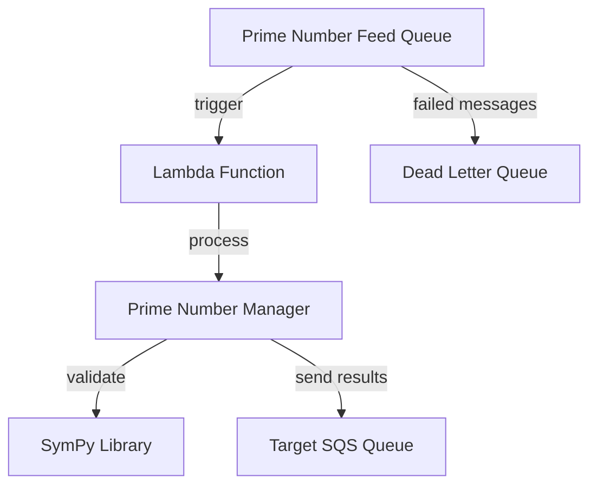

# Lambda ➜ SQS Integration

A serverless AWS solution for processing prime numbers through Lambda functions triggered by SQS messages, with automatic forwarding of results to a target queue.

## Architecture

## Overview

This project implements a serverless prime number processing system using AWS Lambda and SQS. The system receives batches of numbers through an SQS queue, processes them to identify prime numbers using the SymPy library, and forwards the results to a target queue for downstream processing.

**Key Features:**
- **Event-driven processing**: Lambda functions triggered by SQS messages
- **Prime number detection**: Uses SymPy for efficient prime number validation
- **Error handling**: Dead letter queue for failed message processing
- **Scalable architecture**: Configurable concurrency and batch processing
- **Monitoring**: Built-in logging and message attributes for tracking

## Components

### Lambda Function (`handler.py`)
- **Function**: `prime_number_processing`
- **Runtime**: Python 3.11
- **Memory**: 128MB
- **Timeout**: 30 seconds
- **Concurrency**: Limited to 10 concurrent executions

### Prime Number Manager (`src/prime_numbers_processing/`)
- Core business logic for prime number detection
- Integrates with AWS SQS for result forwarding
- Separates prime and non-prime numbers
- Includes message attributes for metadata tracking

### AWS Utilities (`src/utils/`)
- SQS client wrapper for message operations
- Support for single and batch message sending
- Error handling with boto3 ClientError exceptions
- Regional configuration (default: us-east-2)

### Infrastructure (Serverless Framework)
- **Queue Configuration**: 
  - Main queue: `prime-number-feed-sqs`
  - Dead letter queue: `dlq-prime-number-feed-sqs`
  - Message retention: 60 seconds
  - Visibility timeout: 60 seconds
- **IAM Permissions**: SQS send/delete message permissions
- **Event Source**: SQS trigger with batch size of 1

## Message Flow

1. **Input**: Messages containing number arrays sent to `prime-number-feed-sqs`
2. **Processing**: Lambda function processes each SQS record
3. **Validation**: Prime numbers identified using SymPy
4. **Output**: Prime numbers forwarded to target SQS queue
5. **Error Handling**: Failed messages routed to dead letter queue after 10 attempts

## Configuration

The system uses environment variables for configuration:
- `SQS_PRIMES_TARGET`: Target queue URL for prime number results
- AWS region: `us-east-2` (configurable)

## Deployment

Built with the Serverless Framework v3, the project includes:
- Python requirements management
- Development dependency exclusion
- Custom SQS queue creation
- IAM role configuration

This architecture provides a robust, scalable solution for prime number processing workloads with built-in error handling and monitoring capabilities.